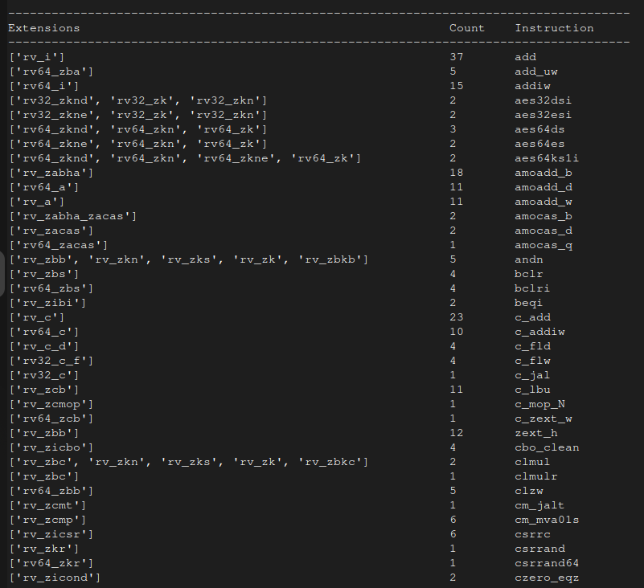

# Instruction Set Explorer

A Python-based tooling project for exploring and cross-referencing RISC-V ISA extensions using:

- `instr_dict.json`
- the official RISC-V ISA manual sources
- automated extension analysis

This project was developed as part of the coding challenge for the RISC-V Mentorship Instruction Set Explorer task.

## Project Goals

The repository performs three major tasks:

1. Parse and analyze instruction-extension mappings from `instr_dict.json`
2. Scan the official RISC-V ISA manual AsciiDoc sources for extension references
3. Cross-reference both datasets to identify:
   - matching extensions
   - extensions missing from either source
   - extension relationships

The project also includes:
- automated repository cloning
- unit tests
- reusable parsing utilities

---

# Usage 

- Example Output


---
The working assumption is that the riscv-isa-manual is in the directory and in the event that it is not present the 
program clones it by default.


To run the tests 
```sh
python -m unittest discover tests
```
